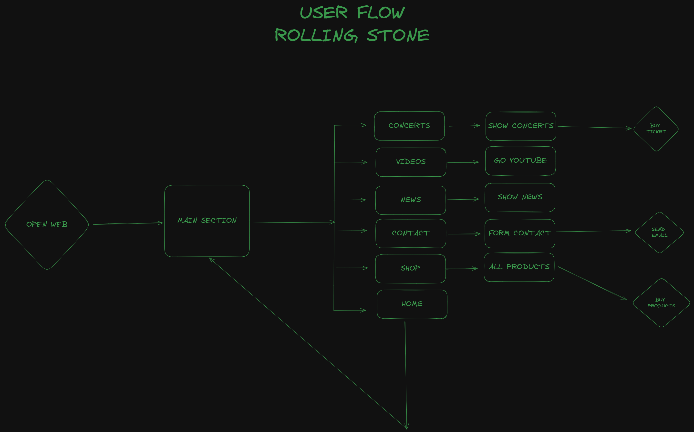

# Proyecto Web Tributo a los Rolling Stones

## Descripción

Este es un proyecto colaborativo para crear una página web en tributo a los Rolling Stones. La web incluirá información sobre la banda, su discografía, giras, y mucho más.

## User Flow



## Tecnologías utilizadas

- HTML
- SASS
- TypeScript
- Vite


## Colaboradores 

[Borja Fernández](https://github.com/BarmanDev)

[Matilde Gracia](https://github.com/MatiGarciaS)


## Dev Dependencies
- Vite [https://vitejs.dev/]
- Sass [https://sass-lang.com/]
- Typescript [https://www.typescriptlang.org/]

## Installation
```
npm install
npm run dev
```

## Production
```
npm run build
npm run preview
```